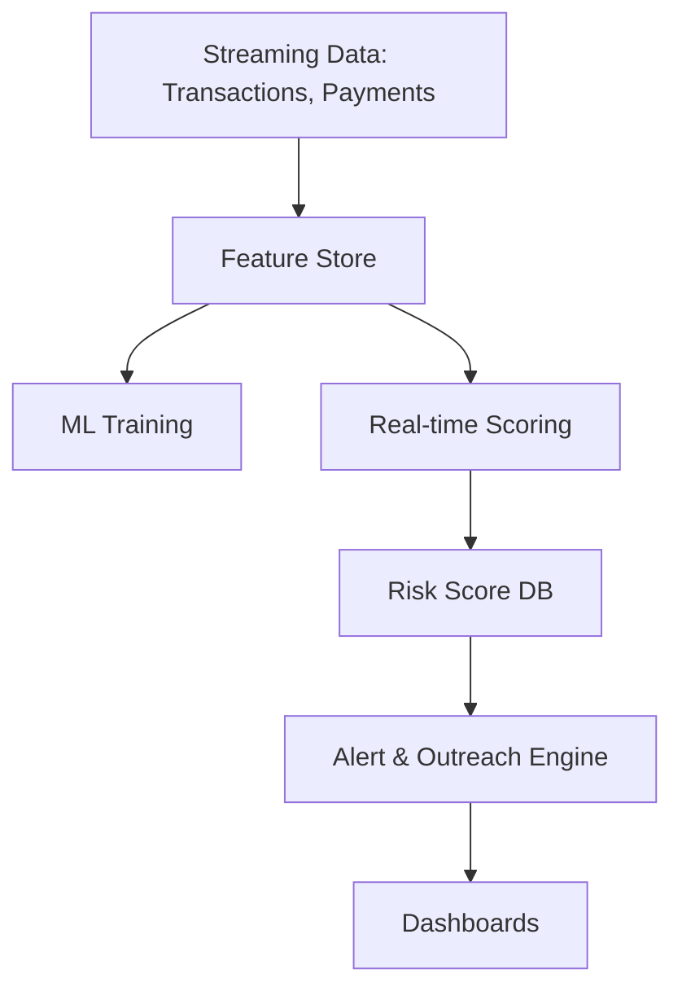

# Pre-Delinquency Intervention Engine

A predictive analytics platform that detects early warning signals of financial stress and triggers proactive outreach before a missed payment occurs.

## 🎯 Objectives
- Predict likelihood of delinquency **2–4 weeks ahead**
- Detect early stress signals from transaction behavior
- Trigger proactive and empathetic interventions (payment holiday, restructuring, counseling)

## 🔍 Key Signals
- Salary credited later than normal  
- Savings balance declining week-over-week  
- Increased UPI transfers to lending apps  
- Utility payments delayed  
- Reduced discretionary spending  
- Increased ATM withdrawals  
- Failed auto-debit attempts  

## 🧠 ML Approach
- Feature Engineering + Time-series behavioral signals  
- Classification models: XGBoost / LightGBM  
- Explainability: SHAP for risk factor explanations  

## 🏗️ Architecture (High-level)



## 📁 Repo Structure
- `src/` → Core pipelines and ML logic  
- `docs/` → Architecture notes  
- `data/` → Sample datasets (no PII)  
- `notebooks/` → Exploratory analysis  

## 🚀 Next Steps
- Build transaction simulator  
- Add model training pipeline  
- Add scoring API with FastAPI / BentoML  
- Add dashboards (Dash / QuickSight mock)

---

## 📌 How to run (coming soon)

```
python -m src.pipelines.offline_pipeline
```
