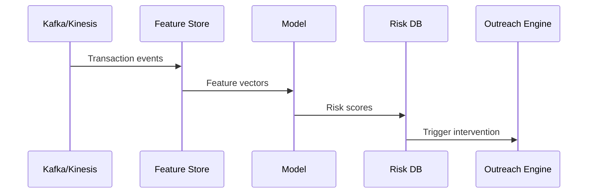

# Architecture Notes

## 1. Data Sources
- Core banking transactions
- Card spending logs
- Utility bill payments
- Salary credits
- Savings account balances

## 2. Feature Store
Features stored daily with time windows:
- 7/14/30-day spend trend
- Salary delay days
- Balance delta
- % change in discretionary spend

## 3. Model Training
- Binary classification: default in 2–4 weeks
- Labels from historical delinquency
- Models: LightGBM, XGBoost

## 4. Scoring
- Real-time scoring for active customers
- Risk score persisted for outreach decisions

## 5. Intervention
- Trigger proactive outreach via SMS/app/CRM
- Message personalization based on stress factors

---

## Mermaid Flow

